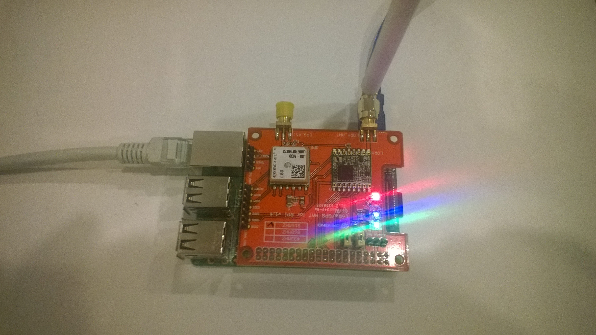
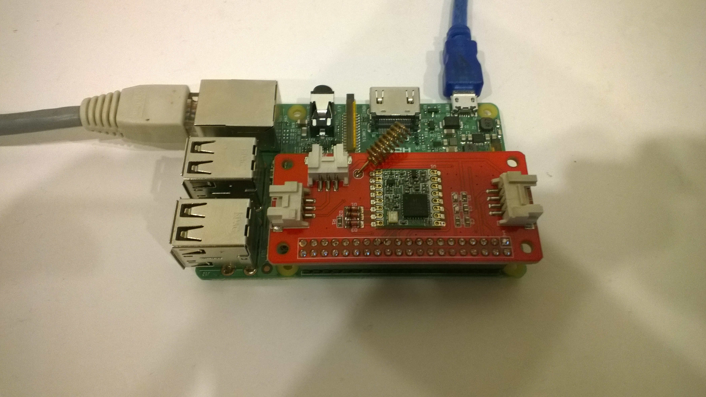
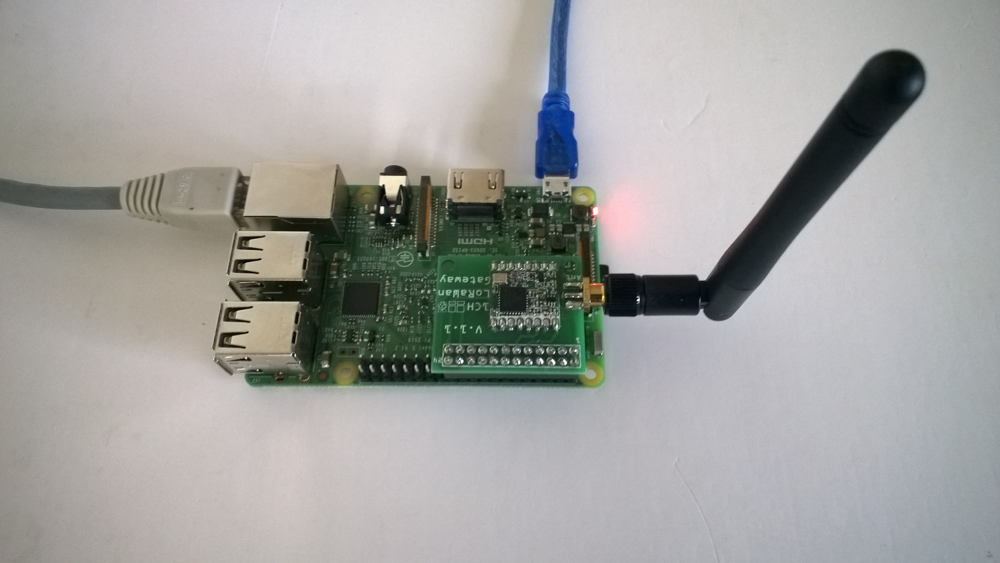
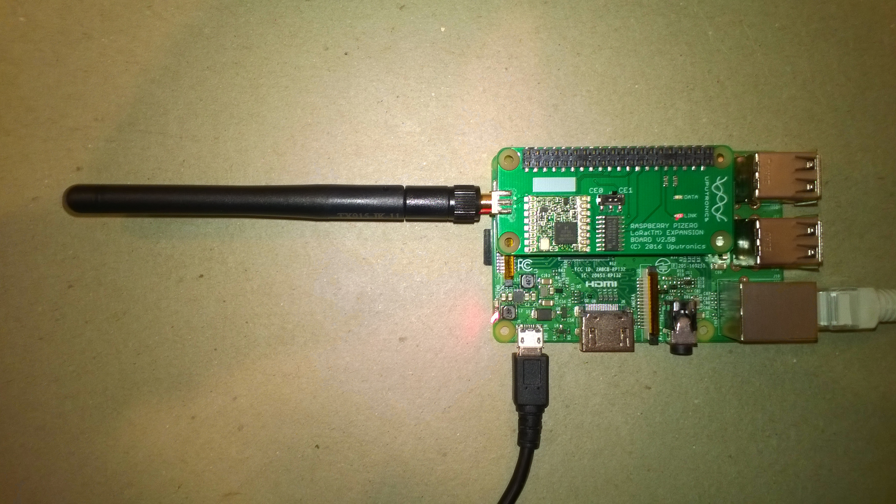
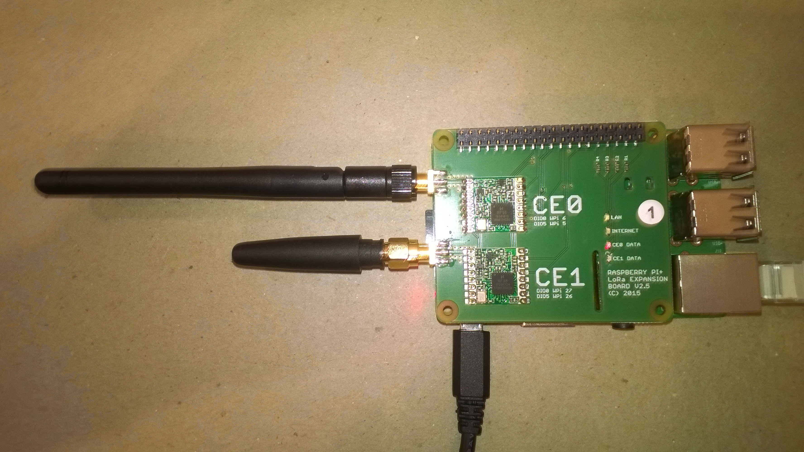
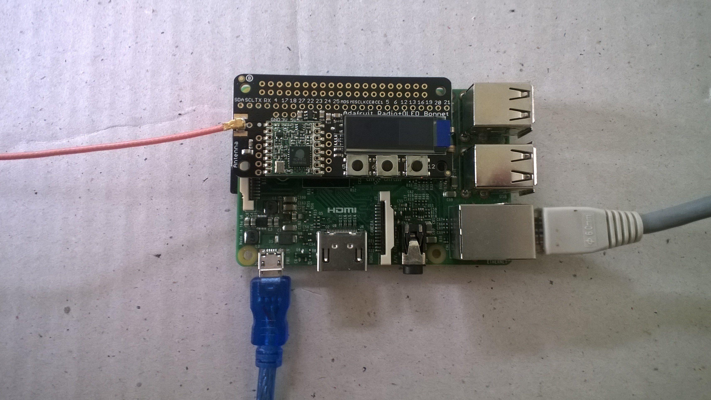

# SX127X.NetCore
A C# library for LoRa[LoRaAlliance](https://lora-alliance.org/) connectivity for Semtech [SX127X](https://www.semtech.com/products/wireless-rf/lora-transceivers/SX1276)/HopeRF [RFMRFM9X](http://www.hoperf.com/rf_transceiver/lora/RFM95W.html) equipped shields on  Windows 10 IoT Core Raspbery PI devices.

The repo has the source code for the series of blog posts written as I built this library

00. [dotNET Core 5 Raspberry PI SPI](http://blog.devmobile.co.nz/2021/07/19/net-core-5-raspberry-pi-spi-sx127x/)
01. [TransferFullDuplex vs. ReadWrite](http://blog.devmobile.co.nz/2021/07/22/net-core-5-sx127x-library-part1/)
02. [Register Reading and Writing](http://blog.devmobile.co.nz/2021/07/22/net-core-5-sx127x-library-part2/)
03. [Transmit Basic](http://blog.devmobile.co.nz/2021/07/23/net-core-5-sx127x-library-part3/)
04. [Receive Basic](http://blog.devmobile.co.nz/2021/07/25/net-core-5-sx127x-library-part4/)
05. [Receive and Transmit with Interrupts](http://blog.devmobile.co.nz/2021/07/26/net-core-5-sx127x-library-part5/)

SX127XLoRaDevice - the library source code
SX127XLoRaDeviceClient - Sample application which illustrates how to call the library and has  conditional compile options for the supported pHats

There are also a parallel development projects which are documented seperately 

[nanoFramework](http://blog.devmobile.co.nz/2020/04/10/nanoframework-lora-library-part1/)
[TinyCLROSV2](http://blog.devmobile.co.nz/2020/07/08/tinyclr-os-v2-rc1-lora-library-part1/)
[Wilderness Labs Meadow](http://blog.devmobile.co.nz/2019/12/25/net-meadow-lora-library-part1/)
[Windows 10 IoT Core](http://blog.devmobile.co.nz/2018/07/30/windows-10-iot-core-lora-library/)

My main use case for the Library is a telemetery protocol translation field gateway(working on identity translation) uploading data from a number of remote devices.

Shield from [Dragino](http://www.dragino.com/products/lora/item/106-lora-gps-hat.html)

Shield from [Elecrow](https://www.elecrow.com/lora-rfm95-iot-board-for-rpi.html)

Shield from [M2M](https://www.tindie.com/products/m2m/1-channel-lorawan-gateway-shield-for-raspberry-pi)

RPIZero Shield from [Uputronics](https://store.uputronics.com/index.php?route=product/product&path=61&product_id=91)

RPIPlus Shield from [Uputronics](https://store.uputronics.com/index.php?route=product/product&path=61&product_id=68)

LoRa Radio Bonnet from [Adafruit](https://www.adafruit.com/product/4074) 

